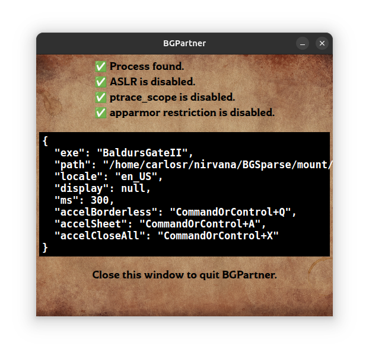

# BGPartner

BGPartner (Baldur's Gate Partner) is a Linux/Windows (64 and 32 bits respectively) companion tool for the Enhanced Editions v2.6.6 of Baldur's Gate and Baldur's Gate II: Shadows of Amn. It produces overlays on user-selected creatures detailing their stats and active effects.

It's a [Node.js](https://nodejs.org) + [Electron](https://www.electronjs.org)/[Forge](https://www.electronforge.io) + [Koffi](https://koffi.dev) + [Handlebars](https://handlebarsjs.com) project.

## Acknowledgments

Though implemented from scratch, this project draws heavily from [BG2RadarOverlay](https://github.com/tapahob/BG2RadarOverlay) and makes extensive use of [EEEx's documentation](https://eeex-docs.readthedocs.io).

## Quickstart

Go to [releases](https://github.com/gatperdut/bg-partner/releases) and download the version for your OS, then unzip the files somewhere, and follow the instructions below according to your OS.

Note that whether you run first BGPartner and then the game, or viceversa, is irrelevant. When launched, BGPartner will either wait for the game to start, or detect it if it is already running.

### Windows

Just run the executable - double-click on it, or run it from a shell for some more output with `BGPartner.exe`.

### Linux

Linux is a bit more involved.

First off, both `ASLR` (address space layout randomization) and `ptrace_scope` need to be disabled. The following commands will take care of changing the system settings, but these will not survive a system restart.

- ASLR: `echo 0 > /proc/sys/kernel/randomize_va_space`
- ptrace: `echo 0 > /proc/sys/kernel/yama/ptrace_scope`

There are ways to make the changes permanent, but that is not recommended. Re-run the commands next time you boot up the computer and want to use BGPartner. Alternatively, check [linux_on.sh](scripts/linux_on.sh) that automatizes it.

When you are done with BGPartner, exchange the `0` with a `1` in the commands and run them again (or simply restart, or run [linux_off.sh](scripts/linux_off.sh)).

Additionally, make sure the following tools are available:

- `xdotool`
- `wmctrl`

You can use `apt`, `pacman`, etc. For example, `sudo apt install xdotool`.

Once you are ready, go in your terminal to BGPartner's directory and do `./BGPartner`.

### Configuration

On its first execution BGPartner will create a [JSON](https://www.shapediver.com/blog/json-objects-explained) file called `bg-partner.json` where it stores its configuration, which you can edit. These are the default values:

```
  {
    "exe": "BaldursGateII" (Linux) / "Baldur.exe" (Windows),
    "path": "/home/<user>" (Linux) / "TODO" (Windows),
    "locale": "en_US",
    "display": null,
    "ms": 300,
    "accelBorderless": "CommandOrControl+Q",
    "accelSheet": "CommandOrControl+A",
  };

```

- `exe`: the name of the executable. On Windows this is always `Baldur.exe`, and will likely require no change. On Linux it is either `BaldursGate` or `BaldursGateII`, so edit accordingly.

- `path`: the path to the installation folder. Use absolute paths and, on Linux, avoid `~`.

- `locale`: language. Must be one of `de_DE`, `en_US`, `es_ES`, `fr_FR`, `it_IT`, `ko_KR`, `pl_PL`, `ru_RU`, and `zh_CN`.

- `display`: `null` to use your primary display, or a number between 0 and 1 less than your number of displays (`0` or `1` if you have two displays, for example). This may require a bit of trial and error. Run the game in whatever display you select here.

- `ms`: refresh rate in milliseconds.

- `accelBorderless`: accelerator to make the game's window borderless and fullscreen.

- `accelSheet`: accelerator to open the overlay when the mouse is over the selection circle of a creature.

Accelerators will only be active while the game is focused, so those key combinations will remain available to be used elsewhere while BGPartner is running.

Accelerators must follow the pattern indicated by [Electron's accelerators](https://www.electronjs.org/docs/latest/api/accelerator).

### How to use

The games must _not_ be run in "Full screen" mode (deactivate that option in the "Graphics" options).

Once BGPartner launches successfully, you will see this window:



The upper line will display "❌ Process not found." if no running instance of a game could be found.

The next 2 lines are Linux-Only and will indicate if the configuration steps from above were successful. If they were not, they will display "❌ ASLR is enabled." and "❌ ptrace_scope is enabled." respectively.

Next up is the configuration in use. This will closely resemble your `bg-partner.json`, though individual keys may have reverted to the defaults if the provided value was invalid. The JSON object might have been replaced in its entirety, too, if, for example, you provided an invalid JSON. So make sure to double-check.

As the bottom line indicates, BGPartner will shut down as soon as this window is closed.

Now go to your game and use your `accelBorderless` shortcut to make the game window borderless. It will also take the full display.

Next, move the mouse over some creature and use your `accelSheet` shortcut. You will see something like this:

TODO

## Bugs and reports

BGPartner is very much in development, specially when it comes to testing under different environments. So far, only the Steam version of the games under Ubuntu / Windows 11 are officially supported.

If you encounter problems or would like to share your suggestions please note them down as a Github issue [here](https://github.com/gatperdut/bg-partner/issues).

BGPartner never quite worked on Ubuntu with Wayland, so xorg is recommended.

## Development

Same requirements apply as for running BGPartner in your OS of choice.

Additionally:

- Check `.nvmrc` for the Node.js version. On Linux, `nvm use`.
- `npm i` to install dependencies.
- `npm run start` to launch.

[Visual Studio Code](https://code.visualstudio.com) is a good IDE to consider.

You may need to tell Windows Defender to whitelist the folder where the source code resides. There might be slowdowns otherwise.

### gdb process

#### Linux

Simply do `pidof BaldursGate` or `pidof BaldursGateII` and then, with the produced pid, do `gdb -p <pid>`.

#### Windows

You can install gdb with an admin shell via Chocolatey.

```
Set-ExecutionPolicy Bypass -Scope Process -Force; [System.Net.ServicePointManager]::SecurityProtocol = [System.Net.ServicePointManager]::SecurityProtocol -bor 3072; iex ((New-Object System.Net.WebClient).DownloadString('https://community.chocolatey.org/install.ps1'))

choco install mingw -y

$env:Path += ";C:\ProgramData\chocolatey\bin"
```

In a newly opened regular shell do `(Get-Process Baldur).Id` and then, with the produced pid, do `gdb -p <pid>`.

But it will suck. TODO.

### gdb for files
You can also use gdb to examine binary files like `.biff`, but it needs a dummy process, and you must allocate enough memory for the file. For example, the following will print `66 'B'	73 'I'	70 'F'	70 'F'` if executed from the game's `data` folder:
```
bash&
gdb -p $(pgrep -n bash)
(gdb) call malloc(1024 * 1024 * 2)
(gdb) restore Spells.bif binary $1
(gdb) x/4cb $1
```

## Development TODOs

- readme: how to close sheets. sheets hide when game loses focus.

- sheets in windows become gradually bigger when draging them?!

- consider LE/BE in resread?

- do the callbacks need `${id}`?

- detect game pause?
